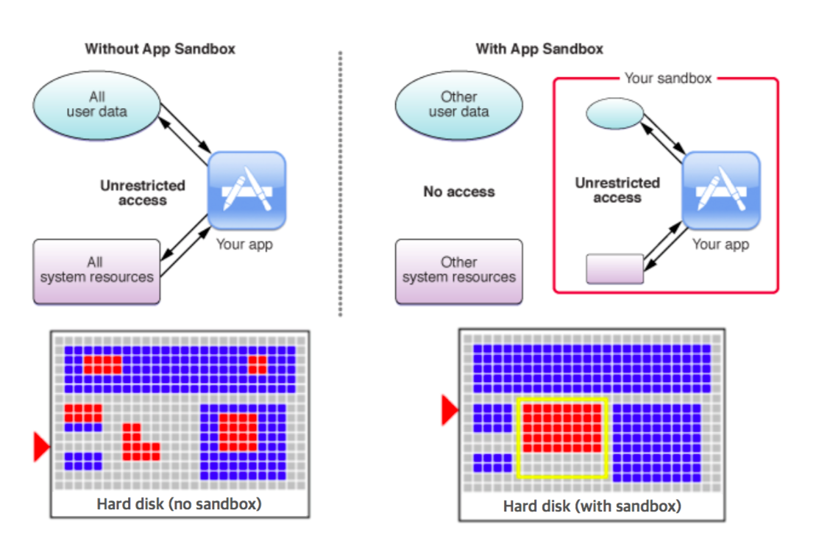

# App Sandboxing

## Sandbox

- **앱의 권한을 원하는 기능으로 제한**
- **악의적인 소프트웨어로 인해 사용자 시스템이 손상되는 것을 방지**
- **시스템과 사용자를 보호 할 수 있는 좋은 방법**

### Without vs With Sandbox

## Bundle

- 파일 시스템에서의 하나의 directory
- 실행가능 파일(Executable), Info.plist 각종 Resources(이미지, 사운드, strings 등)를 함께 그룹화
- **Codesign Tool이 Signin을 위해 Bunde Container를 불러와 Code Seal 적용**

> https://developer.apple.com/library/content/documentation/Security/Conceptual/CodeSigningGuide/Introduction/Introduction.html#//apple_ref/doc/uid/TP40005929-CH1-SW1

- **Static Library - Executable 파일에 통합 컴파일**

> 정적 라이브러리는 루틴들과 외부 함수들 그리고 변수들의 집합으로서, 컴파일 타임에 호출자에 의해 리졸브되며 컴파일러와 링커에 의해 목적 파일과 독립된 실행 파일을 생성하기 위해 대상 애플리케이션에 복사된다.[1]이 실행 파일과 이것을 컴파일링 하는 과정 모두 프로그램의 정적 빌드로 알려져 있다. 역사적으로, 라이브러리들은 단지 정적이었었다. 정적 라이브러리들은 다른 정적 라이브러리와 목적 파일들과 빌딩/링킹 시에 단일 실행 파일을 생성하기 위해 통합되거나 런타임 시에 메모리에 올라온 실행 파일의 주소 공간(컴파일 타임/링크 타임에 결정되는 정적 메모리 오프셋)에 로드된다.

- Dynamic Library 및 Framework 는 Frameworks 디렉토리에 존재

> 동적 라이브러리 (dynamic library) 는 소프트웨어의 일종으로, 말 그대로 동적 링크를 사용한 라이브러리이다. 여러 프로그램이 공통으로 필요로 하는 기능을 프로그램과는 분리하여 필요할 때에만 불러내어 쓸 수 있게 만들어 놓은 라이브러리를 말한다.
예를 들어 「마우스 포인터가 지금 화면 어디에 있는지를 조사」하는 기능은 다양한 프로그램(응용 프로그램)이 공통적으로 사용하려는 기능으로 여겨지므로, 그 부분만을 모듈화하고, 여러 프로그램들이 사용할 수 있도록 하는 것이 낫다. 이러한 경우 이 기능을 동적 라이브러리로서 만들어 놓는 경우가 많다.
- wikipedia

- 읽기 전용. 수정이 필요한 경우 데이터 컨테이너로 옮겨서 작업
- iTunes, iCloud에 백업되지 않음

## Data

### Data Container 위치

**NSHomeDirectory()**

- Data Container의 홈 디렉토리
- Documents, Library, Temp 가 기본 구성
- 사용자가 직접 디렉토리나 파일을 추가할 수 없으며 Documents 같은 서브디렉토리를 통해 관리
- StoreKit(인 앱 결제 관련) 등 앱에서 사용하는 데이터에 따라 시스템이 그에 맞는 디렉토리 추가
- iOS 11 부터 SystemData 디렉토리 추가

어플
번들 콘테이너
데이터 콘테이너
아이 클라우드 콘테이너

핸드폰?
앱, os, 샌드박스 콘테이너, 아이클라우드 콘테이너