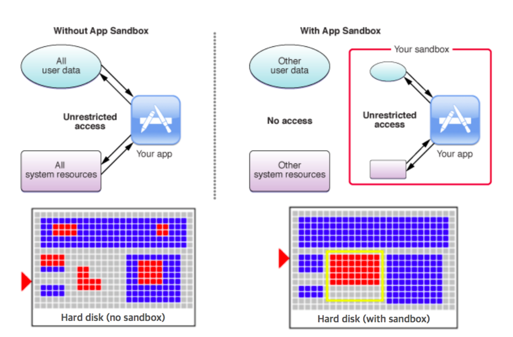

# App Sandboxing

## Sandbox

- **앱의 권한을 원하는 기능으로 제한**
- **악의적인 소프트웨어로 인해 사용자 시스템이 손상되는 것을 방지**
- **시스템과 사용자를 보호 할 수 있는 좋은 방법**

### Without vs With Sandbox

## Bundle

- 파일 시스템에서의 하나의 directory
- 실행가능 파일(Executable), Info.plist 각종 Resources(이미지, 사운드, strings 등)를 함께 그룹화
- **Codesign Tool이 Signin을 위해 Bunde Container를 불러와 Code Seal 적용**
- **Static Library - Executable 파일에 통합 컴파일**
- **Dynamic Library** 및 Framework 는 Frameworks 디렉토리에 존재
- 읽기 전용. 수정이 필요한 경우 데이터 컨테이너로 옮겨서 작업
- iTunes, iCloud에 백업되지 않음

## Data

### Data Container 위치

**NSHomeDirectory()**

- Data Container의 홈 디렉토리
- Documents, Library, Temp 가 기본 구성
- 사용자가 직접 디렉토리나 파일을 추가할 수 없으며 Documents 같은 서브디렉토리를 통해 관리
- StoreKit(인 앱 결제 관련) 등 앱에서 사용하는 데이터에 따라 시스템이 그에 맞는 디렉토리 추가
- iOS 11 부터 SystemData 디렉토리 추가

어플
번들 콘테이너
데이터 콘테이너
아이 클라우드 콘테이너

핸드폰?
앱, os, 샌드박스 콘테이너, 아이클라우드 콘테이너