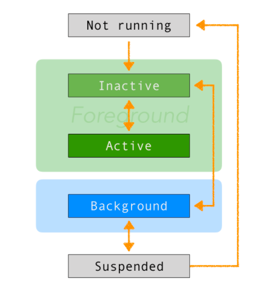

# Application Life Cycle

앱의 생명주기는 사용자가 앱 아이콘을 탭하면서 시작되고 앱이 종료되면서 종료된다. 종료되는 것은 홈 버튼을 두 번 클릭한 다음 앱 카드를 스와이프하여 앱을 닫을 수 있다. 또한, iOS와 같은 멀티 태스킹 시스템에서 운영체제 자체에서 앱을 종료 시킬 수 있다. 따라서, 개발자는 앱의 라이프 사이클을 이해하여 데이터 무결성을 유지하고 사용자에게 끊김없는 경험을 제공하는 것이 중요하다.

## States in the App Life Cycle

앱은 아이콘을 탭한 순간부터 앱이 종료되는 순간까지 앱 라이프 사이클에서 각 순간마다 별개의 상태에 있다. 

## The Structure of an App

- application을 시작하는 동안 UIAdplicationmain 기능은 몇개의 주요 개체를 설정하고 application 활동을 시작합니다.
-  모든 iOS앱의 중심에는 UIApplication개체가 있습니다.

