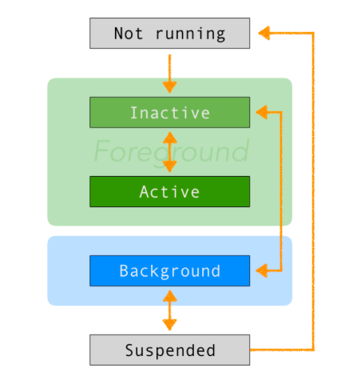

# Application Life Cycle

앱의 생명주기는 사용자가 앱 아이콘을 탭하면서 시작되고 앱이 종료되면서 종료된다. 종료되는 것은 홈 버튼을 두 번 클릭한 다음 앱 카드를 스와이프하여 앱을 닫을 수 있다. 또한, iOS와 같은 멀티 태스킹 시스템에서 운영체제 자체에서 앱을 종료 시킬 수 있다. 따라서, 개발자는 앱의 라이프 사이클을 이해하여 데이터 무결성을 유지하고 사용자에게 끊김없는 경험을 제공하는 것이 중요하다.

## States in the App Life Cycle

앱은 아이콘을 탭한 순간부터 앱이 종료되는 순간까지 앱 라이프 사이클에서 각 순간마다 별개의 상태에 있다. 



- Not running
	
	아직 앱이 실행되지 않은 단계, 또는 유저나 시스템에 의해 종료된 상태
	
- Inactive

	앱이 foreground에 있지만, OS로부터 이벤트를 받지 않음. 잠깐 비활성화되어 다른 상태로 바뀝니다.

- Active

	앱이 실행 중이고 운영 체제에서 이벤트를 수신하는 상태. 앱을 사용하는 동안의 일반적인 상태

- Background

	앱이 백그라운드에 있지만 실행되고 있는 상태. 일반적으로 앱은 잠시 Inactive 상태가 되었다가, 다른 상태로 전환됨.

- Suspended

	앱이 백그라운드에 있으며 실행되지 않는 상태. 앱을 Suspended 하는 이벤트에는, 사용자가 앱을 사용하는 동안 홈 버튼을 누르거나 전화 통화를받는 사용자가 포함됨.

## Handling App Transitions

응용 프로그램은 상태 전환이 일어날 때 시스템에 알리고, 필요한 경우 이러한 전환을 다루는 것이 프로그래머 역할입니다. 예를 들어 백그라운드로 전환하여 장치의 영구 저장소에 데이터를 저장하고 서비스 실행을 중지하며 현재 어떤 화면이 활성 상태인지 추적 할 수 있습니다. 마찬가지로 활성 상태로 전환하여 데이터를 로드하고 서비스를 시작하며 마지막으로 열었던 화면을 복원 할 수 있습니다.

시스템은 현재 상태에 따라 앱에서 다음 기능 중 하나를 호출합니다.

- application:willFinishLaunchingWithOptions:

앱이 시작할 때 코드를 실행할 첫번째 기회

- application:didFinishLaunchingWithOptions:

앱이 사용자에게 표시되기 전에 최종 초기화를 수행

-applicationDidBecomeActive:

앱이 곧 foreground 상태가 됩니다. 이곳에서 마지막으로 준비합니다.

- applicationWillResignActive:

앱이 foreground 상태에서 다른 상태로 전환됩니다. 이곳은 자료를 저장하기에 이상적인 장소입니다

- applicationDidEnterBackground:

현재 앱이 background에서 실행되고 있지만 여전히 코드를 실행할 수 있습니다.

- applicationWillEnterForeground:

앱이 background에서 벗어나 foreground로 돌아 왔지만 아직 활성화되지 않았 음을 알 수 있습니다.

- applicationWillTerminate:

앱이 종료되고 있음을 알려줍니다. 앱이 이미 일시 중지 된 경우 이 메소드가 호출되지 않으므로 이 상태에 도달하기 전에 데이터를 저장하십시오.

> 이러한 기능 중 하나 이상에 코드를 제공하여 이러한 시스템 호출에 응답 할 수 있습니다. 프로젝트의 AppDelegate.swift 파일에서이 작업을 수행합니다.

## A Practical Understanding of the App Life Cycle

single view app을 만들고, App Life Cycle을 불러봅시다. project를 만들고, **AppDelegate.swift**를 열어보세요. 그러면 이미 만들어진 5개의 빈 function을 볼 수 있습니다. 여기에 각각 어떤 일을 하는지 print문을 적으세요.

```
func application(_ application: UIApplication, didFinishLaunchingWithOptions launchOptions: [UIApplicationLaunchOptionsKey: Any]?) -> Bool {
        print("Did finish launching.")
        return true
    }
 
    func applicationWillResignActive(_ application: UIApplication) {
        print("App will resign active.")
    }
 
    func applicationDidEnterBackground(_ application: UIApplication) {
        print("App did enter background.")
    }
 
    func applicationWillEnterForeground(_ application: UIApplication) {
        print("App will enter foreground.")
    }
 
    func applicationDidBecomeActive(_ application: UIApplication) {
        print("App did become active.")
    }
 
    func applicationWillTerminate(_ application: UIApplication) {
        print("App will terminate.")
    }
```
1. 앱 실행
 - 실행 완료됐습니다.
 - active가 됐습니다.
2. 홈 버튼 누르기
 - 앱이 active를 그만 둘 겁니다.
 - background에 들어갔습니다.
3. 앱 아이콘 눌러서 다시 열기
 - foreground에 들어갈겁니다.
 - active가 됐습니다.
4. 홈버튼을 2번 눌러 App Switcher 열기
 - 앱이 active를 그만 둘 겁니다.
5. App Switcher(홈 버튼 2번)에서 앱의 카드를 밀기.
 - background에 들어갔습니다.
 - 앱이 종료될 겁니다.


> 라이프 사이클이 언제 실행되는지 실습하는 것

## Counting the Events during the App Life Cycle

> 라이프 사이클의 사용을 넓혀보는 것

## Which Method Should You Use?

많은 수의 전환에 응답 할 수 있지만 가장 많이 사용할 세 가지 방법은

applicationDidFinishLaunchingWithOptions
applicationWillResignActive
applicationDidBecomeActive.
이 세 가지 기능을 통해 앱 시작, 종료 및 재 개설시기를 알 수 있습니다.

잘 했어! 이제 iOS App Life Cycle을 마스터했습니다. 등을 가볍게 두드리며 ...이 튜토리얼을 즐긴다면 언제든지 공유하십시오 :