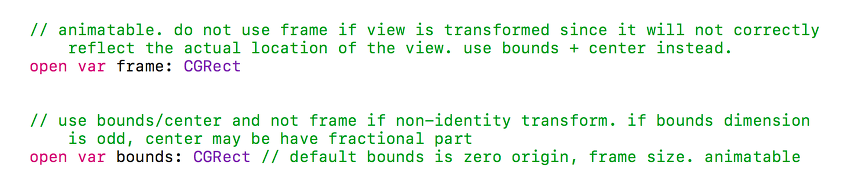
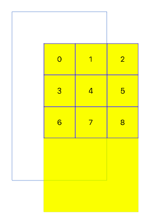
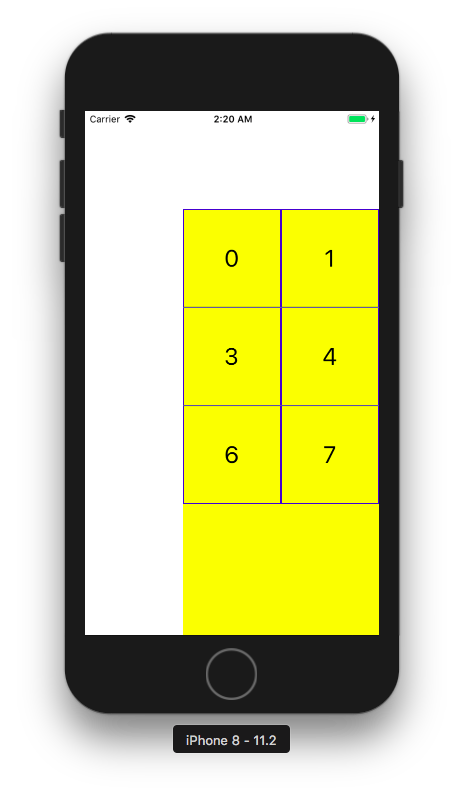
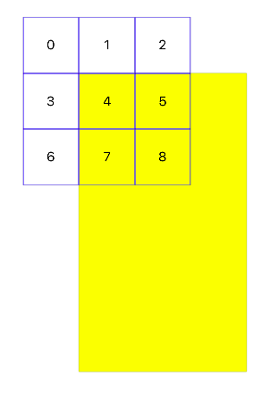
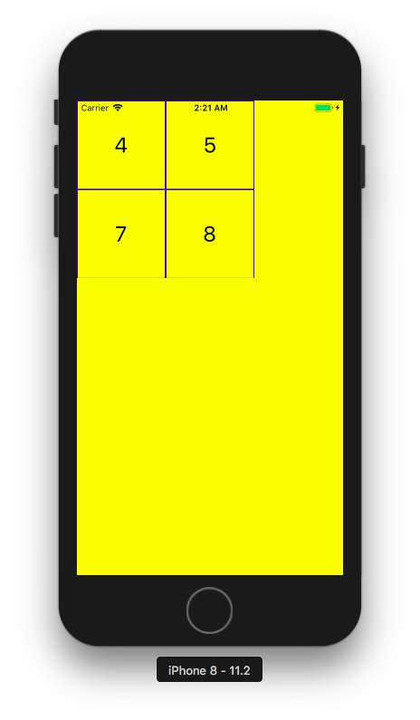

# Frame vs Bounds

처음 GCRect로 크기를 정할 때 이 둘의 차이가 없는 것에서 의문을 가졌다. 그래서 이 둘을 비교해 보았다.

이 둘을 비교하기전에 우선 CGRect에 대해서 알아보면 CGRect는 두개의 구성요소로 되어있다.

CGPoint와 CGSize이다.
CGPoint는 위치를 나타낼 때 사용하고, CGSize는 객체의 크기를 나타낸다.

고로 CGSize의 width, height를 사용할 때는 차이가 없다.

하지만 CGPoint 부분을 사용할 때, 이 둘의 차이가 났다.

- 뷰 움직일 때는 bounds를 사용하라고 나와있다.

- frame은 포인트를 외부에서 찾기때문에 생성된 뷰가 상위 뷰의 우측 하단으로 밑에 생긴다.

- bounds는 포인트를 자신의 내부에서 찾는다. 그래서 좌표를 보면 우측 상단으로 올라갔는데, 이것은 좌표가 올라간 것이 아니다. 뷰가 좌표의 좌측 하단으로 내려간 것이다.

- 가장 크게 차이 나는 것은 보이는 뷰가 frame은 움직이지 않고 하위뷰를 움직여서 생성한데 비해, bounds는 하위뷰가 움직이지 않고 보이는 뷰 자체가 움직여서 하위뷰를 생성했다.

결국, 뷰에서 위치를 나타낼 때는 frame, 변형되는 움직임을 나타낼 때는 bounds를 사용한다.
