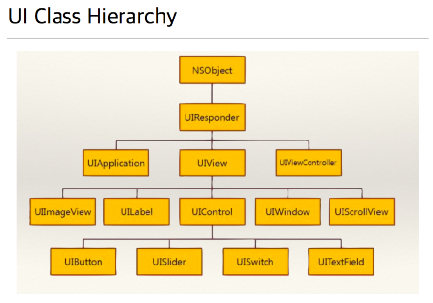

# Framework

- 프로그래밍에서 특정 운영 체제를 위한 응용 프로그램 표준 구조를 구현하는 클래스와 라이브러리 모임

# UIKit Framework

- Cocoa Touch Framework에 추가된 UI관련 기능의 클래스가 모여있는 Framework

## UIResponder

- 이벤트에 응답하고 이벤트를 처리하는 개체의 인터페이스를 정의

## UIView

- 가장 기본이 되는 View
- 화면의 직사각형 영역에 대한 내용을 관리하는 개체

## UIImageView

- 인터페이스에 이미지 또는 애니메이션 영상을 표시하는 개체

## UILabel

- 보여주기 위한 텍스트를 표시하기만 하는 뷰
- 보통 label을 제어하기 위한 장치와 같이 사용됨

### UILabel Font

## UIControl

- 반응의 제어를 위한, 특별한 행동이나 목적을 가지고 유저의 액션에 반응하는 시각적인 요소의 기본 클래스

### UIButton

- 사용자의 액션에 따라 지정된 코드를 실행하는 컨트롤