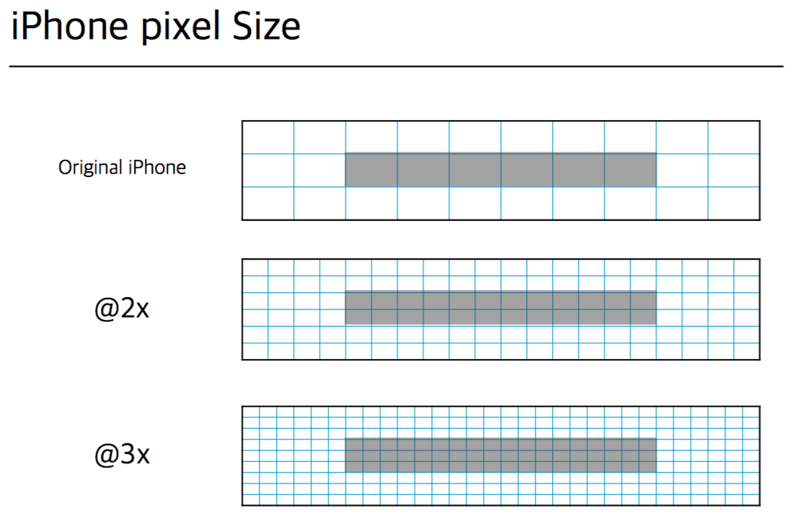
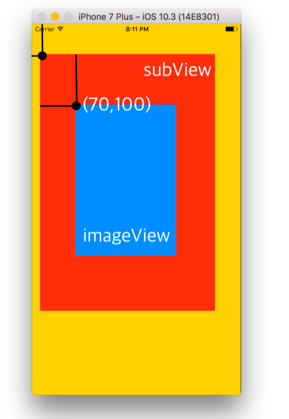

# UI BASE GUIDE
## 화면 표시 단위
- **Pixel**: 실제 표시되는 이미지, 가장 작은 단위
- **Point**: 화면에 표시되는 이미지

> 표시된 부분: **Point**  
> 눈금 한칸: **Pixel**

## 좌표계

- View기준 좌측 상단이 0,0
- View의 위치는 좌측상단이 기준
- View의 위치는 상위뷰가 기준

