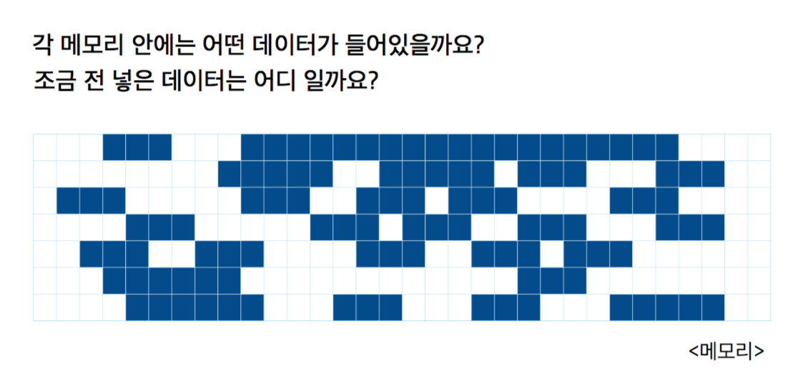

# 변수&함수
## 정의
- 변수(데이터): 데이터 저장 공간
- 함수: 실행되는 부분

> 프로퍼티: 객체에 속한 데이터  
ex) Person 객체의 name, age 등이 Person 객체의 프로퍼티

### 변수 in Memory

> 메모리를 찾고 구분하기 위해 데이터명, 데이터 타입 지정

## 구성
- 변수: 키워드 + 변수명 + 타입
- 함수: 키워드 + 함수명 + 입력값 + 출력타입 + 함수 내용

### 키워드
- var: 변할 수 있는 값
- let: 변할 수 없는 값

### 변수명&함수명
- 의미와 쓰임을 알 수 있게 명명
- 중복 불가
- 공백 불가
- 시스템 예약어 불가
- 숫자로 시작 불가

> 변수&함수명: lowerCamelCase  
> 클래스&타입명: UpperCamelCase

### 타입
#### 기본형
- Int/Uint: 정수형 타입
 - Int: +/- 부호를 포함한 정수
 - Uint: 양의 정수
- Double/Float: 실수형 타입
 - Double: 64bit
 - Float: 32bit
- String/Character: 문자형 타입
 - 
- Bool: true, false값으로 리턴

#### 참조형