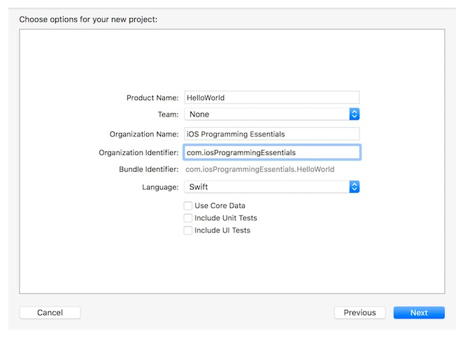
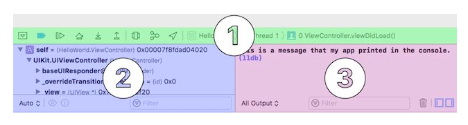

# 🧰 Xcode 사용 가이드

## 📌 개요

Xcode는 Apple 플랫폼(iOS, macOS, watchOS, tvOS 등)을 위한 **통합 개발 환경(IDE)** 입니다.
다음과 같은 핵심 기능을 제공합니다:

* **Interface Builder**: 화면 크기에 최적화된 UI 설계
* **Code Editor**: Swift / Objective-C 코드 작성
* **Simulator & Debugger**: 앱 테스트 및 오류 추적

---

## 🚀 시작 화면

| 항목             | 설명                |
| -------------- | ----------------- |
| **가장 최근 프로젝트** | 최대 10개 프로젝트 빠른 접근 |
| **Playground** | 개념 실험 및 코드 테스트 공간 |
| **프로젝트 생성**    | 새 프로젝트 시작         |
| **프로젝트 복제**    | Git 저장소에서 클론하여 시작 |

---

## 📦 템플릿 선택

* **플랫폼별 템플릿 제공** (iOS, macOS 등)
* 선택 시 관련 프레임워크와 기본 코드 포함
* 앱, 프레임워크, 라이브러리 시작점 구성

---

## 🛠️ 프로젝트 옵션 설정

| 항목                          | 설명                              |
| --------------------------- | ------------------------------- |
| **Product Name**            | 앱 이름 (아이콘 아래 표시)                |
| **Team**                    | Apple Developer Program 계정 (선택) |
| **Organization Name**       | 개인/팀 이름 (생략 가능)                 |
| **Organization Identifier** | 도메인 반전 형식 (예: com.example)      |
| **Language**                | Swift / Objective-C 선택 가능       |
| **Use Core Data**           | 데이터 저장을 위한 설정 포함                |
| **Include Unit/UI Tests**   | 테스트 코드 자동 생성 여부                 |

> 💡 **보일러플레이트(boilerplate)**
> 템플릿으로 제공되는 기본 코드 구조로, 반복 사용 가능

---

## 🧭 Xcode 인터페이스 구성

### ① Toolbar

| 구역      | 설명                      |
| ------- | ----------------------- |
| **왼쪽**  | 시뮬레이터 또는 기기에서 실행/빌드     |
| **중앙**  | 실행 상태 및 빌드 메시지 표시       |
| **오른쪽** | 에디터 종류 선택 및 UI 숨김/표시 조절 |

* **Standard Editor** (한 문서 보기)
* **Assistant Editor** (두 문서 보기)
* **Version Editor** (버전 비교)

---

### ② Navigator Area

| 탐색기                | 설명                      |
| ------------------ | ----------------------- |
| **Project**        | 프로젝트 구성 파일 전체           |
| **Source Control** | Git 브랜치, 커밋, 태그 관리      |
| **Symbol**         | 클래스, 메서드 등 전체 구조 보기     |
| **Find**           | 문자열 검색                  |
| **Issue**          | 경고 및 오류 메시지             |
| **Test**           | Unit/UI 테스트 상태 확인       |
| **Debug**          | 메모리, CPU, 네트워크 사용량 모니터링 |
| **Breakpoint**     | 모든 중단점 관리               |
| **Report**         | 빌드/실행 로그 확인             |

---

### ③ Editor Area

* 코드 작성 및 UI 구성의 중심 영역
* 선택한 파일의 타입에 따라 코드, Storyboard, 설정 등 다양한 뷰 제공
* **Editor Selector** 로 편집 모드 변경 가능

---

### ④ Debug Area

| 구역                      | 설명              |
| ----------------------- | --------------- |
| **Toolbar**             | 실행/일시정지/중단 등 제어 |
| **Variables Inspector** | 변수 상태 실시간 확인    |
| **Console**             | 로그, 프린트 출력 등 표시 |

---

### ⑤ Utility Area

| 관리자                       | 설명                        |
| ------------------------- | ------------------------- |
| **File Inspector**        | 파일명, 경로, 타입 정보            |
| **Quick Help**            | 선택 객체에 대한 설명              |
| **Identity Inspector**    | 연결된 클래스 등 ID 정보           |
| **Attributes Inspector**  | UI 속성 설정                  |
| **Size Inspector**        | 크기 및 오토레이아웃 제약 설정         |
| **Connections Inspector** | 코드와 UI 연결 확인 (IBAction 등) |

#### 📚 하단 라이브러리

| 라이브러리                     | 설명                        |
| ------------------------- | ------------------------- |
| **File Template Library** | 파일 생성 템플릿                 |
| **Code Snippet Library**  | 자주 쓰는 코드 저장/사용            |
| **Object Library**        | UI 컴포넌트 (Label, Button 등) |
| **Media Library**         | 이미지, 사운드, 영상 등 리소스        |

---

## 🔗 참고 링크

* [📘 iOS Programming Essentials](http://iosprogrammingessentials.com)
