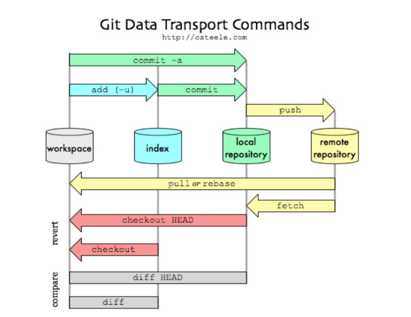

# 🧬 Git 기초 가이드

## 📌 What is Git?

Git은 **소스 코드 변경 사항을 추적하고 버전을 관리**할 수 있도록 도와주는
**분산 버전 관리 시스템(DVCS)** 입니다.

* 팀 협업, 백업, 실험 분기 등에 최적화
* GitHub, GitLab 등은 Git 기반 **서비스 플랫폼**일 뿐입니다

---

## 🏗️ Git의 구조

Git은 작업을 다음 4가지 공간으로 나누어 관리합니다:

| 구분                                | 설명                       |
| --------------------------------- | ------------------------ |
| **1. Work Space**                 | 실제 작업하는 디렉토리             |
| **2. Index (Staging Area)**       | 커밋을 위한 준비 공간             |
| **3. 내부 저장소 (Local Repository)**  | 내 컴퓨터의 Git 데이터 저장소       |
| **4. 외부 저장소 (Remote Repository)** | GitHub 등 외부 서버에 존재하는 저장소 |

> 💡 **GitHub는 Git을 사용하는 수많은 플랫폼 중 하나입니다.**

---

## 🧪 Git 명령어 요약



| 주요 명령        | 설명                     |
| ------------ | ---------------------- |
| `git init`   | Git 저장소 생성             |
| `git status` | 변경 파일 확인               |
| `git add`    | 파일을 Staging Area로 이동   |
| `git commit` | 변경 사항을 저장소에 기록         |
| `git push`   | 로컬 변경사항을 원격 저장소로 업로드   |
| `git pull`   | 원격 저장소의 변경사항을 로컬로 가져옴  |
| `git clone`  | 원격 저장소를 복제하여 로컬 저장소 생성 |

---

## 🙅‍♂️ Git Ignore

`.gitignore` 파일은 **Git이 추적하지 않아야 할 파일이나 폴더**를 지정하는 설정 파일입니다.

### 📍 주의 사항

* **최상위 디렉토리에 위치**
* **등록 순서 중요**
* 파일을 먼저 Git에 등록한 후 `.gitignore`에 추가해도 무시되지 않음 (이미 추적 중)
* `.gitignore` 저장 후 커밋 필요

### 🧾 사용 예시

```gitignore
# 모든 .a 파일 제외
*.a

# lib.a는 포함
!lib.a

# 현재 디렉토리의 TODO 파일만 제외
/TODO

# build 디렉토리 내 모든 파일 제외
build/

# doc 디렉토리의 .txt 파일 제외 (하위 폴더 제외)
doc/*.txt

# doc 및 하위 디렉토리의 .pdf 파일 제외
doc/**/*.pdf

# *_sample.* 형식의 모든 파일 제외
*_sample.*
```

---

## 📚 참고 사이트

* [📘 간편 Git 안내서 (한국어)](http://rogerdudler.github.io/git-guide/index.ko.html)
* [🔧 브랜치 시뮬레이터 (GUI)](http://learnbranch.urigit.com/)
* [📖 Pro Git 번역서 (공식)](http://git-scm.com/book/ko/v2)
