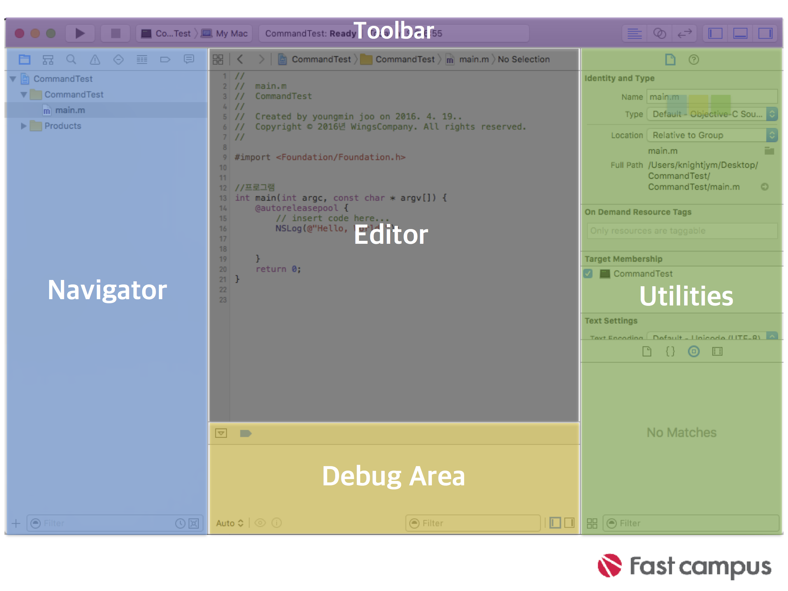

# XCode

## 개요

- IDE(IntegratedProgrammingEnvironment)를 통해 iOS, Ma.S, tv OS hO S 및 감시 애플리케이션을 만들고 테스트하고 디버깅 할 수 있는 기능을 제공
- 인터페이스 작성기를 사용하여 앱의 사용자 인터페이스를 모든 화면 크기에 맞게 최적으로 작동하고 외관도 좋게 설계
- 코드 편집기를 사용하여 앱이 하는 일을 하게 만드는 코드 라인을 작성
- 시뮬레이터 및 디버깅을 사용하여 애플리케이션을 테스트하고 오류를 효율적으로 처리

## 시작

1. **가장 최근 프로젝트**: 최대 10개까지 최근 작업한 프로젝트로 빠른 액세스 시킴
2. **Playground**: 프로젝트 밖에서 새로운 개념을 배우고 테스트 하기 위한 곳
3. **프로젝트 생성**
4. **프로젝트 복제**

## 템플릿 선택

- XCode는 맥 환경의 모든 플랫폼 지원
- 선택한 플랫폼에 따라 관련된 애플리케이션 및 프레임워크, 라이브러리 템플릿 표시
- 관련 코드를 포함한 시작점 생성

## 프로젝트 옵션 선택

- 앱의 이름과 일부 앱 관련 세부 정보를 입력

- Product Name: 앱 이름, 앱 아이콘 아래에 표시
- Team: AppleDeveloperProgram 회원이라면 프로필 선택 가능, 아니면 무시. 실제 장치에서 테스트하거나, 앱스토어에 추가하기 위해서 필요
- Organization Name: 내 이름이나 조직 이름 입력. 비워둘 수 있음
- Organization Identifier: 응용 프로그램에 대한 고유 식별자 생성하는데 사용, 응용식별자는 번들 식별자에 역표기법으로 표시.
- Language: XCode는 Swift와 Object-C지원
- Use Core Data: 기기에 데이터를 저장하기 위한 코드 설정
- Include Unit Tests: 유닛 테스트를 수행하는 코드 포함
- Include UI Tests: UI Test를 수행하는 코드 포함

> **보일러 플레이트**: 변경없이 계속하여 재사용할 수 있는 저작품. 여기서는 코드로 볼 수 있다.

## Xcode Workspace

- ToolBar: 시뮬레이터사용과 전체적인 XCode UI 조작
- Navigator Area: 프로젝트 관리를 위한 도구 모음
- Editor Area: Project Navigator에서 선택한 파일의 내용을 수정하는 화면
- Debug Area: 프로그램 실행 중 Debuging를 위한 콘솔창
- Utilities Area: Project Navigator에서 선택된 파일의 상세 정보 및 UI속성 수정등의 작업을 위한 공간

---

① ToolBar

- 시뮬레이터나 기기에 빌드하거나 실행할때 사용
- 기기 이름을 클릭해서 앱을 실행할 다른 기기 선택 가능

- 앱을 만들고 실행하는 동안 상태 메시지가 표시
- 오류 표시를 클릭하면 추가적인 설명을 제공

- 에디터 옵션에서는 하나의 문서를 표시하는 Standard Editor (다섯 줄), 한 번에 두 개의 다른 파일을 보여주는 Assistant Editor (두 원) 및 두 파일을 비교하는 Version Editor (두 개의 화살표)
- 작업 영역 구성 영역에서는 navigation, debug 및 utilities 영역을 숨기거나 표시하여 editor 영역의 사용 가능한 공간을 조절 가능

② Navigator Area

- Project Navigator: 프로젝트를 구성하는 모든 파일을 표시
- Source Control Navigator: Apple은 XCode 9에 GitHub의 기능 추가. 이 탐색기를 사용하면 소스 제어를 사용하는 사람이 분기, 태그 및 원격에서 작업 가능
- Symbol Navigator: 프로젝트의 모든 클래스, 구성원 및 메서드를 보는 것 가능
- Find Navigator: 프로젝트 파일 검색 기능
- Issue Navigator: 문제 해결에 도움이 되는 추가 정보와 함께 경고( 노란 색)와 오류( 빨간 색)를 표시
- Test Navigator: 프로젝트가 현재 통과했는지 실패했는지 보여주는 Unit 테스트와 UI 테스트 목록.
- Debug Navigator: 시뮬레이터 또는 장치에서 사용하는 현재 메모리 및 CPU 사용량과 저장소 및 네트워크 액세스를 표시
- Debug Navigator: 모든 Break Point 표시, exception 및 symbolic breakpoint을 생성 가능
- Report Navigator: 앱을 작성하고 실행할 때마다 로그 항목이 만들어지고 이 탐색기에서 보는 것이 가능

③ Editor Area

- Xcode의 주요 영역
- 앱의 코드, 사용자 인터페이스 및 프로젝트 설정에 대한 작업을 수행
- Editor Selector를 클릭하여 에디터를 변경 가능
- 선택한 파일에 따라 화면이 바뀜

④ Debug Area

1. Toolbar: 프로그램 실행을 관리하는 컨트롤 제공
2. Variables Inspector: 현재 메모리에 있는 모든 변수 검사
3. Console: 앱이나 시스템의 로깅 정보를 표시

⑤ Utility Area

- 파일 검사기 : 현재 활성화한 파일에 대한 이름, 유형 및 경로와 같은 정보를 표시
- Quick Help 관리자 : 선택한 객체에 대한 간단한 설명을 표시
- Identity 관리자: 선택한 개체의 ID 관련 정보 표시, 사용자 인터페이스 객체에 특정 클래스 할당할 때 자주 사용
- Attributes 관리자: 사용자 인터페이스 요소의 특성 선택 가능
- Size 관리자: 선택한 개체의 크기 및 제약 조건 설정
- Connections 관리자: UI요소와 Source code사이의 연결 표시

- File Template Library: 파일이나 프로젝트를 생성할 때 표시되는 선택과 동일한 파일들
- Code Snippet Library: 프로젝트에 끌어다 쓸 수 있는 코드들
- Object Library: 모든 사용자 인터페이스 요소
- Media Library: 현재 프로젝트에서 사용할 수 있는 모든 소리, 이미지 및 비디오

✽ [참조 사이트](http://iosprogrammingessentials.com)
